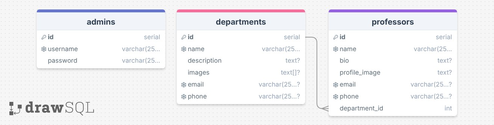

# Fullstack University API

This backend allows users to see the departments and faculty of the university. Admins are able to create, update, and delete departments and faculty.

## Database



<details>
<summary>See DBML</summary>

```dbml
table admins {
  id serial [pk]
  username varchar(255) [unique, not null]
  password varchar(255) [not null]
}

table departments {
  id serial [pk]
  name tvarchar(255)ext [unique, not null]
  description text
  images text[]
  email varchar(255) [unique]
  phone varchar(255) [unique]
}

table professors {
  id serial [pk]
  name varchar(255) [unique, not null]
  bio varchar(255)
  profile_image text
  email varchar(255) [unique]
  phone varchar(255) [unique]
  department_id int [not null]
}

Ref: departments.id < professors.department_id
```

</details>

## API

`/admins` router

- 🔒`POST /admins/register`
  - sends 400 if request body is missing username or password
  - creates a new admin with the provided credentials and sends a token
  - the password is hashed in the database
- `POST /admins/login`
  - sends 400 if request body is missing username or password
  - sends a token if the provided credentials are valid

`/departments` router

- `GET /departments` sends array of all departments
- 🔒`POST /departments` creates a new department
  - sends 400 if request body does not include `name`
- `GET /departments/:id` sends details of the specified department
- 🔒`PUT /departments/:id` updates the specified department
  - sends 400 if request body does not include `name`
- 🔒`DELETE /departments/:id` deletes the specified department
- `GET /departments/:id/professors` sends array of professors in specified department

`/professors` router

- `GET /professors` sends array of all professors
- 🔒`POST /professors` creates a new professor
  - sends 400 if request body does not include `name` and `department`
- `GET /professors/:id` sends details of the specified professor
- 🔒`PUT /professors/:id` update the specified professor
  - sends 400 if request body does not include `name` and `department`
- 🔒`DELETE /professors/:id` deletes the specified professor
- `GET /professors/:id/department` sends the department of the specified professor
